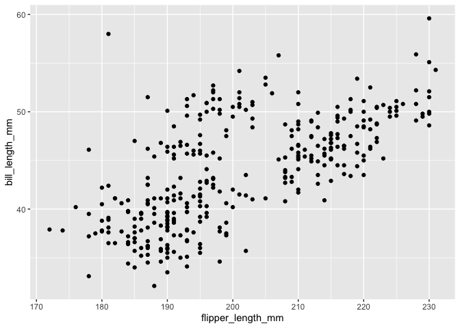
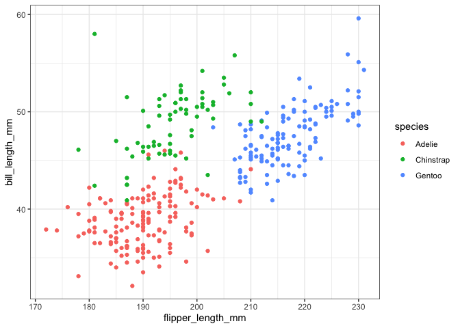

Hw1
================
Yuan Meng
2021-9-29

\#Problem 1

``` r
library(tidyverse)
df_1 = tibble(
  vec_norm = rnorm(10),
  vec_log = vec_norm > 0,
  vec_char = c("My", "name", "is", "Yuan", "I", "like", "travel", "and", "read", "novels"),
  vec_factor = factor(c("I","II","III","II","III","II","I","II","III","I"))
) #generate a data frame
df_1
```

    ## # A tibble: 10 × 4
    ##    vec_norm vec_log vec_char vec_factor
    ##       <dbl> <lgl>   <chr>    <fct>     
    ##  1   0.471  TRUE    My       I         
    ##  2  -1.34   FALSE   name     II        
    ##  3  -1.07   FALSE   is       III       
    ##  4   0.525  TRUE    Yuan     II        
    ##  5   2.89   TRUE    I        III       
    ##  6  -0.265  FALSE   like     II        
    ##  7   1.42   TRUE    travel   I         
    ##  8   0.155  TRUE    and      II        
    ##  9  -0.0820 FALSE   read     III       
    ## 10   1.22   TRUE    novels   I

``` r
x1_norm = df_1 %>% pull(vec_norm) # pull random sample variable out of the dataframe
x2_log = df_1 %>% pull(vec_log)  # pull logical vector variable out of the dataframe
x3_char = df_1 %>% pull(vec_char) # pull character vector variable out of the dataframe
x4_factor = df_1 %>% pull(vec_factor) # pull factor vector variable out of the dataframe
mean(x1_norm) # calculate mean
```

    ## [1] 0.393147

``` r
mean(x2_log)
```

    ## [1] 0.6

``` r
mean(x3_char)
```

    ## Warning in mean.default(x3_char): argument is not numeric or logical: returning
    ## NA

    ## [1] NA

``` r
mean(x4_factor)
```

    ## Warning in mean.default(x4_factor): argument is not numeric or logical:
    ## returning NA

    ## [1] NA

We can see that mean does not work for character vector and it work for
random sample, character vector, and factor vector.

``` r
as.numeric(x1_norm)  #convert variables from one type to another (to numerical type)
as.numeric(x2_log)   #convert variables from one type to another
as.numeric(x3_char)  #convert variables from one type to another
as.numeric(x4_factor) #convert variables from one type to another
```

\#Problem2

``` r
data("penguins", package = "palmerpenguins") #load the penguins dataset
penguins
```

    ## # A tibble: 344 × 8
    ##    species island    bill_length_mm bill_depth_mm flipper_length_mm body_mass_g
    ##    <fct>   <fct>              <dbl>         <dbl>             <int>       <int>
    ##  1 Adelie  Torgersen           39.1          18.7               181        3750
    ##  2 Adelie  Torgersen           39.5          17.4               186        3800
    ##  3 Adelie  Torgersen           40.3          18                 195        3250
    ##  4 Adelie  Torgersen           NA            NA                  NA          NA
    ##  5 Adelie  Torgersen           36.7          19.3               193        3450
    ##  6 Adelie  Torgersen           39.3          20.6               190        3650
    ##  7 Adelie  Torgersen           38.9          17.8               181        3625
    ##  8 Adelie  Torgersen           39.2          19.6               195        4675
    ##  9 Adelie  Torgersen           34.1          18.1               193        3475
    ## 10 Adelie  Torgersen           42            20.2               190        4250
    ## # … with 334 more rows, and 2 more variables: sex <fct>, year <int>

The number of the observation is 344. The dataset of penguins have
several variables. They are species, island, bill\_length\_mm,
bill\_depth\_mm,f lipper\_length\_mm, body\_mass\_g, sex, year.There are
three type of species: Adelie, Chinstrap, and Gentoo. Those species from
three different island. There are Torgersen, Biscoe, and Dream. The
years are 2007, 2008, and 2009.

For the size of the data set, it have 344rows and `r ncol(penguins)`
columns.The mean flipper length is 200.9152047

``` r
ggplot() + geom_point(aes(x=flipper_length_mm,
                   y=bill_length_mm),
               data=penguins)  #Make a scatterplot for flipper_length_mm vs bill_length_mm
```

    ## Warning: Removed 2 rows containing missing values (geom_point).

<!-- -->

``` r
ggsave("scatter_plot.pdf", height = 4, width = 6) # Export scatterplot to project directory
```

    ## Warning: Removed 2 rows containing missing values (geom_point).

``` r
gcolor_penguin <- ggplot() + 
    theme_bw() + geom_point(aes(x=flipper_length_mm,
                   y=bill_length_mm,
                   col=species),
               data=penguins) # color points using the species variable
gcolor_penguin
```

    ## Warning: Removed 2 rows containing missing values (geom_point).

<!-- -->
